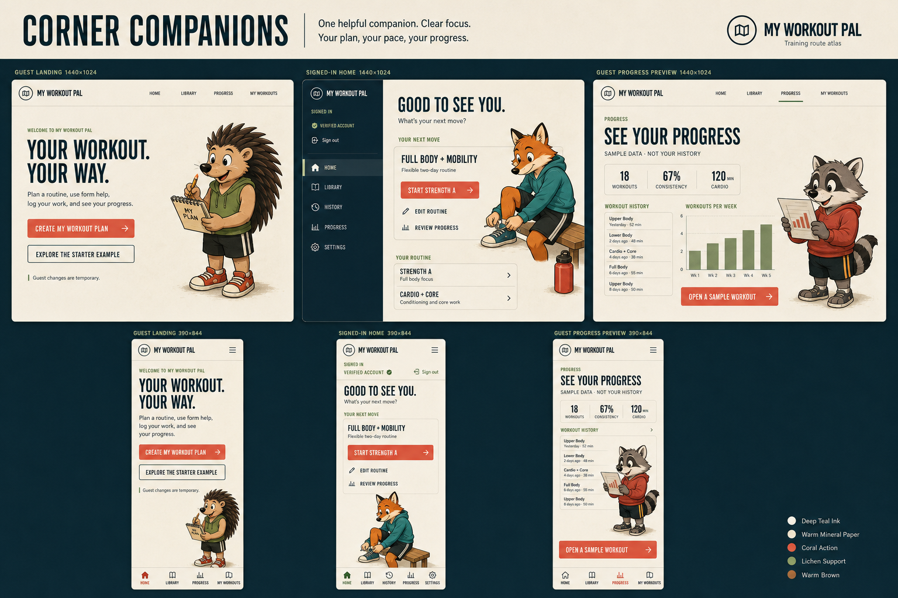

# Corner companions visual direction

**Status:** Implemented and locally verified for the bounded Wave 3 pilot on
`vishal/pal-visual-pilot`. The board is design evidence, not a shipping asset.

Corner Companions is the sole selected animal-surface direction for the guest landing page, signed-in home, and guest progress preview. Apply the same direction to phone and desktop layouts. Do not combine it with discarded concepts.

## Decision record

The Wave 0 review compared three responsive image-based directions. On August 27, 2026, the user selected Corner Companions. The two alternatives were discarded, and their images, prompts, and direction-specific provenance are not retained on this branch.

The selection established the visual target for the bounded pilot. The
implementation changes only presentation on the three approved surfaces and
does not change authentication, persistence, deployment state, or publication
authorization.

## Selected board

Corner Companions gives each approved surface one larger contextual vignette in a reserved quiet area. The companion supports the task without becoming navigation, status, coaching, or a data signal.

Source: [generation prompt](../../.impeccable/mocks/companion-concepts/corner-companions-board.prompt.txt) and [provenance](../../.impeccable/mocks/companion-concepts/corner-companions-board.png.json).

## Product contract

- The guest landing page presents a flexible workout companion for planning, guidance, logging, and progress review. The starter example remains secondary.
- The signed-in home shows an unmistakable personal account state, a flexible routine, a dominant next action, routine editing, and progress review.
- The guest Progress page includes one visible **Sample data · not your history** disclosure. Member surfaces never use sample metrics.
- Desktop layouts use a horizontal public header or member account rail. Phone layouts use fixed bottom navigation and keep the primary action above it.
- Decorative animals stay outside text, fields, charts, disclosures, error states, timers, workout controls, and navigation.

The direction preserves the established warm mineral paper, deep teal-blue ink, coral action, lichen support, stone rules, condensed display silhouette, humanist body copy, and original hand-inked animal language. Production artwork must use purpose-built characters rather than crops from the composite gym illustration.

## Surface placement

- **Guest landing:** Place a planning companion beside the product promise, secondary to the primary and secondary actions.
- **Signed-in home:** Place a preparation vignette near the next-workout area without covering routine or account controls.
- **Progress preview:** Place a calm review companion near, but never inside, the chart or sample-data disclosure.
- **Phone:** Use a dedicated slot after the primary content. Collapse the slot when space, forced colors, or image failure removes the art.
- **Desktop:** Anchor the vignette in main-content whitespace, not the account rail or data plane.

## Accessibility and motion

- Adjacent headings and body copy carry the complete meaning. The illustration never provides the only account, sample, workout, or progress-state signal.
- Use empty alternative text, `aria-hidden`, and pointer-inert behavior for decorative images.
- Hide decorative art in forced-colors mode without leaving a layout gap.
- Keep the complete composition static. Reduced-motion mode must not remove information or state feedback.
- Preserve tested text contrast in light and dark themes and keep artwork outside critical reading and interaction regions.

## Required board corrections

The generated board is directional rather than pixel-accurate production copy:

- Replace **See your progress** with the neutral **Progress** title so the guest preview does not imply personal data.
- Remove generated lettering from the illustrated notebook. Production artwork must keep the notebook text-free.
- Keep visible account identity, verification state, and sign-out controls on every signed-in layout.

## Pilot implementation record

- One reusable decorative companion component owns the closed landing,
  member-home, and Progress-preview variants, responsive sources, empty-alt and
  hidden semantics, and failure collapse.
- Shared tokens reserve companion whitespace. Forced colors removes each slot
  without a gap, reduced motion keeps the art static, and pointer input passes
  through the decorative layer.
- Landing and Progress assets are explicit public-cache entries. The signed-in
  fox and both of its responsive files remain excluded from the public cache,
  along with all private HTML and data.
- The hedgehog and fox use transparent production rasters. The final raccoon is
  an intentionally bounded opaque warm-paper card after lossy chroma extraction
  and a baked-checkerboard rerender were rejected. Its text-free paper, neutral
  Progress title, and nonsemantic pigment dabs carry no personalized data or
  directional trend.
- Final same-state comparisons and privacy-safe browser evidence were retained
  on the reviewed pilot source `b4499f3b953a5745039f1bca67da68e6e135c7c3`.
  The pilot-only directory was intentionally removed when
  `docs/qa/latest/` advanced to the newest coherent evidence set. The fresh
  Impeccable finish-review disposition was `ship`; the pilot result remains
  intentional history.
- This record does not authorize broader rollout, merge, or deployment.

## Pilot acceptance criteria

Before rollout, the pilot must meet the following requirements:

- Verify guest, authenticated, unverified, empty, active-workout, slow, failure, and image-failure states without decorative overlap.
- Verify 320 px, 390 px, 430 px, 820 px, 1,280 px, and 1,440 px widths plus 200% zoom.
- Verify light theme, dark theme, forced colors, reduced motion, keyboard use, pointer use, and assistive-technology behavior.
- Keep the selected artwork provenance-backed, crop-safe, offline-safe where required, and separate from authenticated data and private caches.
- Confirm that image failure leaves product truth, navigation, state, and primary actions intact.

Do not begin the broader surface rollout until the Corner Companions pilot is implemented, browser-verified, and explicitly approved.
