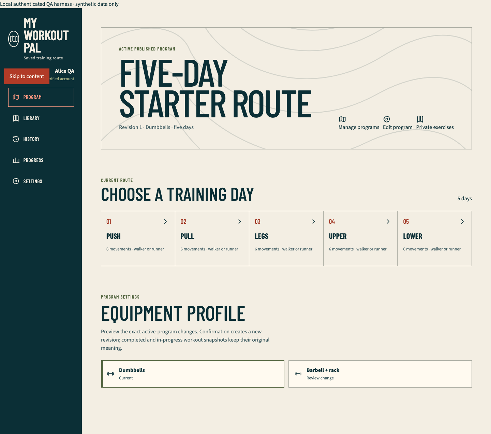
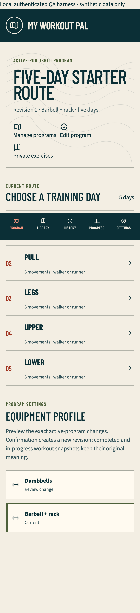

# Authenticated browser harness onboarding checkpoint

## Outcome

The repository now has a separate production-mode Next.js fixture for credential-free authenticated browser verification. It lives under `tests/fixtures/authenticated-app`, outside `src/app`, applies the real Drizzle migrations and starter seed to an in-memory PGlite database, renders production onboarding and member-program components, and invokes production repositories with bounded synthetic server viewers.

This first slice proves onboarding, mutation eligibility, owner scoping, retry truth, and responsive/accessibility behavior without reading Firebase, Neon, Vercel, YouTube, ADC, Postgres, or OIDC credentials. It is not a Firebase emulator and does not prove hosted sessions, providers, email delivery, or secure production cookies.

## Newest visual evidence

Chromium desktop at 1,440 by 1,000 CSS pixels, after Alice created the dumbbell starter:

WebKit phone using the iPhone 14 device profile, after Bob created the barbell starter:

The stitched WebKit image shows Pull, Legs, Upper, and Lower while the fixed bottom navigation covers the Push row at its captured position. The automated DOM assertion independently proves that the ordered list contains all five days.

Both images carry the visible `Local authenticated QA harness · synthetic data only` banner and contain no real account or fitness data.

## Fixture and security boundary

- `pnpm test:e2e:authenticated` selects an available unprivileged port by binding `127.0.0.1:0`, closes that reservation, and passes the selected port to Playwright. The Next fixture starts only on exact loopback and refuses to reuse an existing server.
- The child-process environment is an explicit runtime allowlist. It does not inherit `DATABASE_URL*`, `NEON_*`, `PG*`, `POSTGRES_*`, Firebase, Google ADC, Vercel/OIDC, or YouTube credentials.
- A deterministic runner step copies the maintained `public/contours.svg` into the ignored fixture-public boundary before build and deletes the copy afterward. The fixture build output and temporary asset are ignored.
- The production source-policy test rejects fixture markers and imports beneath `src`. `pnpm production:check` inspects the production App Router manifest after `pnpm build` and rejects any harness or fixture route.
- Synthetic identities are selected out of band before navigation and converted to production `ViewerContext` values on the fixture server. Request bodies and URLs never accept an owner UID.
- Only implemented scenarios are admitted: ready, one-shot slow onboarding, one-shot failed save, expired session, and revoked session. Expired, revoked, malformed, or unknown identity state fails closed at the synthetic sign-in boundary.
- Private responses, including unauthenticated teardown, carry `no-store`. Foreign and nonexistent clone requests return the same status, body, and cache policy and leave Bob's owned program count unchanged.

## Personally observed local flow

Environment: the active `qa/hosted-auth-production` working tree based on released commit `5f7f00167d5a418357b8a36f3413222d03723364`. The fixture was built with Next.js 16.3.2 Webpack and started in production mode; no development watcher or HMR process supplied evidence.

1. Opened expired and revoked Alice contexts. Each stopped at **Sign in required** without loading a private program or producing a failed response.
2. Opened unverified Alice. The production onboarding UI visibly reported **Read-only account**, kept **Create my program** disabled, and had no serious or critical Axe violation.
3. Opened verified Alice, used engine-appropriate keyboard navigation to focus and activate **Skip to content**, created the dumbbell starter, and observed the five ordered Push, Pull, Legs, Upper, and Lower days.
4. Opened verified Bob in the same isolated database scope, selected **Barbell + rack**, created a distinct five-day program, and observed the mobile member layout. The project-level horizontal-overflow assertion ran on Alice's production member-program surface in the same browser project.
5. As Bob, attempted to clone Alice's program and an unknown UUID. Both returned indistinguishable `404 not_found` private responses with equivalent `Cache-Control`; Bob still owned exactly one program afterward.
6. Injected one onboarding `500`. The form stayed on onboarding with an honest error, reused the same idempotency key on retry, then advanced only after the repository returned `201`. Only the explicitly consumed `500` was allowed; every other HTTP failure, console warning/error, and page error remained fatal.
7. Replayed the slice in Chromium desktop and WebKit phone. Both projects completed with clean serious/critical Axe, console, page-error, and unexpected-response collectors.

## Retained red-to-green evidence

- The package-script test first failed because `test:integration` and the authenticated command did not exist. The corrected scripts expose real integration, database, production-manifest, non-browser, public-browser, and authenticated-browser boundaries.
- The harness-policy test first failed because the synthetic context module and runner did not exist.
- The first browser build failed because bundled SQL asset URLs were passed to Node `readFile`. The fixture now resolves the known migration filenames beneath an explicit validated repository root.
- A development-server run produced HMR/router/hydration contamination. The reproducible command now builds and starts the fixture in production mode.
- Browser collection first failed on a missing document title, private-route prefetch `404`s, and `/contours.svg`. Metadata, an honest fixture-only private-route fallback, a response-aware failure collector, and the temporary maintained asset boundary corrected them without masking HTTP failures.
- Assertions first expected non-product equipment copy and the wrong WebKit focus key. They now use the rendered `Dumbbells` and `Barbell + rack` labels plus the established Chromium `Tab` and WebKit `Alt+Tab` path.
- The fixture clone adapter first passed the transport-only `mode` property into a strict repository input and received `400 validation`. It now matches the production route's exact destructuring, so foreign and missing resources reach owner enforcement and return the required `404` equivalence.
- Two policy assertions then failed because the runner inherited the whole local environment and an unauthenticated teardown response lacked `no-store`. The runtime allowlist and cache fix made both pass.
- A dynamic-port policy assertion failed against hard-coded port 3110. The runner-selected loopback port now passes and removes the prior listener-collision class.
- Expired/revoked parser assertions failed while a viewer was still present. Both scenarios now remove the synthetic viewer and pass in unit and browser checks.

## Automated verification

- `pnpm exec vitest run tests/unit/authenticated-harness-policy.test.ts tests/unit/package-scripts.test.ts`: 2 files and 8 tests pass.
- `pnpm typecheck`: pass.
- `pnpm test:e2e:authenticated`: production fixture build passes; 4 of 4 Playwright cases pass across Chromium desktop and WebKit phone.
- Both browser projects verify five program days for dumbbell and barbell profiles, expired/revoked/unverified boundaries, keyboard skip navigation, no horizontal overflow, no unexpected HTTP failure, no browser warning/error or page error, and no serious or critical Axe violation on the scoped states.
- `pnpm verify`: pass on the final source. Strict TypeScript and full lint pass; Vitest passes 78 files and 521 tests; `db:check` passes Drizzle metadata plus 4 files and 33 migration/bootstrap assertions; the default production `seed:check` validates all 27 exact-two variations; PWA parity and 33-document parity pass; the Next.js 16.3.2 Webpack production build passes; and the production route-manifest boundary verifies 41 App Router entries without a harness route.
- `pnpm test:e2e:release`: the primary replay passes 43 public production-mode cases with the one documented WebKit service-worker-control skip across Chromium phone, tablet, and desktop plus WebKit phone.
- Independent review inspected the full diff, fixture boundary, runner environment, production manifest checker, plans, generated documentation, and screenshots; reproduced the 8 focused assertions, 4 authenticated browser cases, complete `pnpm verify`, and a clean 43-case public rerun; and returned explicit approval with no actionable finding. Its first public run observed one nondeterministic cross-origin YouTube `compute-pressure` Permissions-Policy warning in the tablet exercise case; the exact case then passed alone and the clean full rerun passed, so no warning is suppressed in source or retained as a product success state.

## Evidence boundary and next slice

This checkpoint proves only the isolated onboarding/ownership vertical slice plus regression safety for the already-released public application. The fixture header is an out-of-band test control, not a secure-session substitute. It does not prove real Firebase registration, Google consent, email verification or recovery delivery, hosted expiry/revocation, CSRF on HTTPS, secure-cookie attributes, Neon production, or Vercel behavior.

Program collection UI, clone/activate, editing, custom exercises, confirmed equipment revision, real IndexedDB runner recovery, set/cardio logging, interruption reconciliation, history, records, progress, settings, deletion UI, slow/malformed/stale/offline cases, Chromium phone/tablet, WebKit desktop, dark mode, reduced motion, forced colors, 200 percent zoom, and the authenticated media runner remain future harness slices. Hosted provider and production evidence remains a separate release gate after those credential-free paths are complete.
