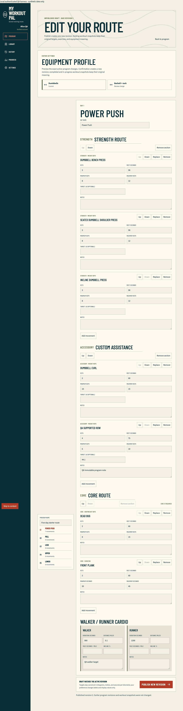
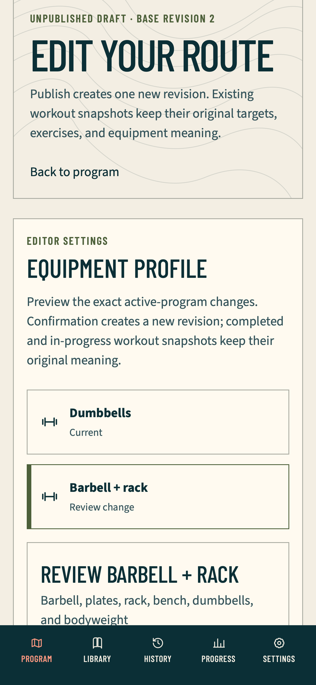
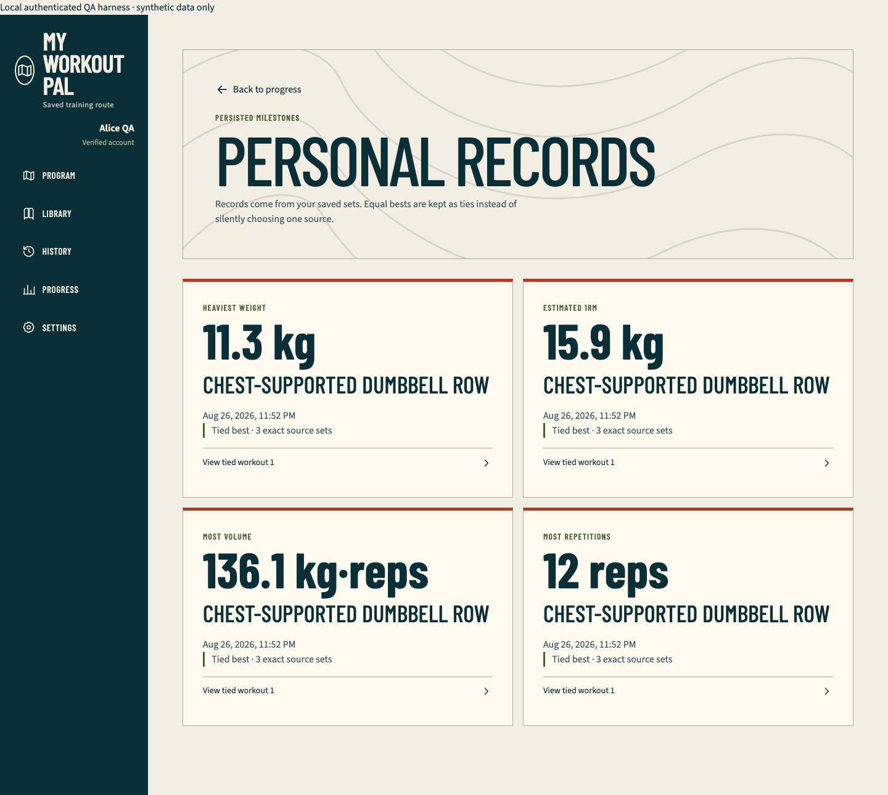

# Authenticated customization and insights QA

## Evidence boundary

- Date: 2026-08-27
- Exact source: `036c31779e179cba6c8e582848998493069aefb4`
- Released base: `cd512006a647ca815f5180cc4dcebb99e1c14bd1`
- Branch: `qa/authenticated-program-customization-insights`
- Runtime: separate production-mode Next.js fixture on a runner-selected loopback port, with deterministic synthetic Alice and Bob identities and an in-memory PGlite database
- Provider effect: none; Firebase, Neon writes, Vercel, GitHub, billing, deployment, and production were untouched

This run proves the credential-free customization, immutable-history, personal-record, and progress vertical. It is not hosted Firebase or production-auth evidence.

## Observed journeys

- Alice created a complete barbell program, cloned it, and keyboard-reactivated the original dumbbell program without an idempotent replay reactivating older state.
- Alice created a compatible private movement, removed and restored a non-core section after destructive review, retained mandatory Core, entered `44.1 lb` and `0.1 mi` sequentially, reordered the movement, and reconciled an accepted-then-`500` publication with the same nonblank idempotency key.
- The editor's Equipment Profile control previewed exactly six dumbbell-to-barbell substitutions: Pull once, Upper twice, and Lower three times, with Push and Legs unchanged. Compatible custom work retained its target/rest/note; a replaced movement cleared only movement-specific targets.
- A separate barbell-to-dumbbells case named a barbell-and-rack-only custom movement, disabled confirmation, restored focus on cancel, and left the profile plus all scoped row counts unchanged.
- A completed Pull workout retained its original dumbbell exercise identity, prescription ranges, rest, equipment, notes, work sets, bodyweight added load, cardio pace, and canonical values after the active program changed to barbell.
- Settings persisted an actual `UTC` to `America/Chicago` change, metric/imperial presentation, and reduced-motion preference without rewriting canonical workout meaning.
- Personal records showed weight, estimated one-repetition maximum, repetition, and truthful `kg·reps` volume ties with bounded source links. Progress derived only from completed owned work sets plus cardio and labelled combined distance honestly.
- Bob's foreign API and rendered routes matched missing resources in status, normalized body, and no-store policy, while Bob's valid empty insights exposed none of Alice's names, values, notes, or identifiers.

The fixture-only no-store scope summary proves write multiplicity and absence of extra rows. Canonical-value equality comes from the production read models and repository assertions, not from row counts.

## Verification

| Gate | Result |
| --- | --- |
| Focused plan/policy | 4 files, 20 tests passed |
| Focused mutation responses | 2 files, 16 tests passed |
| TypeScript and ESLint | Passed |
| Documentation parity | 31 pairs before this report; regenerated after closeout |
| Authenticated production fixture | 17 passed, 1 intentional Chromium-only incompatible-equipment scenario skip, 6 projects |
| Full Vitest | 86 files, 593 tests passed |
| Database gate | Drizzle metadata passed; 4 files, 34 assertions passed |
| Approved-video seed | 27 mappings, exactly two approved videos each |
| PWA parity | Passed |
| Production build and boundary | Passed; 41 App Router entries and no fixture route |
| Public production-mode matrix | 43 passed; the documented WebKit service-worker case skipped |

The first aggregate attempt retained one expected sandbox red: the loopback-only YouTube probe received `listen EPERM`; the permission-correct rerun passed all 593 assertions. The first public-matrix attempt stopped before browser assertions when the fresh build reached `ENOSPC`. Only obsolete Playwright cache revisions were removed; the exact rerun then passed 43 cases with one documented skip.

Browser checks failed on, and implementation corrected, several material boundaries before the final green run: unordered but equivalent equipment and alias response rows; a collection-card tap obscured by fixed mobile navigation; mobile WebKit not focusing a tapped dialog invoker; generic first-party request abort masking; accepted `204` fixture cleanup classified as an aborted request; stale lower-version record rows from warm-ups and skipped exercises; and a blocked incompatible custom movement absent from visible evidence.

## Responsive and accessibility evidence

The complete journey ran in Chromium desktop and WebKit phone. Bounded geometry ran in Chromium phone/tablet and WebKit tablet/desktop as well, using real mobile/touch device descriptors. Tests verified no horizontal overflow, 44-pixel material controls, reachable dialog title and terminal controls, dark mode, reduced motion, supported forced colors, keyboard activation, focus restoration, and no serious or critical Axe findings in ready and material error states.

First-party console warnings/errors, page errors, HTTP responses at or above `400`, and request failures were fail-closed. Only a narrowly identified superseded Next App Router RSC request with `net::ERR_ABORTED` was classified as an intentional navigation cancellation; assets, APIs, documents, and other request failures remained fatal.

Automated viewport geometry is not browser zoom. A headed actual-200-percent zoom inspection remains a manual pre-merge acceptance gate and must not be inferred from device scale or a narrow viewport.

## Retained images

### Customized desktop editor

### Phone equipment review

### Persisted personal records

## Explicitly unproved here

- literal browser offline recovery, post-load expired or revoked authentication recovery, and multi-tab conflict reconciliation;
- full-page Firebase client-auth hydration before account deletion;
- hosted password registration/verification/recovery and Google consent/session flows;
- two real hosted users replaying IDOR and authenticated production surfaces;
- authenticated production video playback/unavailable fallback;
- actual 200-percent headed zoom closeout;
- Vercel Spend Management and notification inspection.

Those remain completion gates; this report does not convert them into synthetic success.
