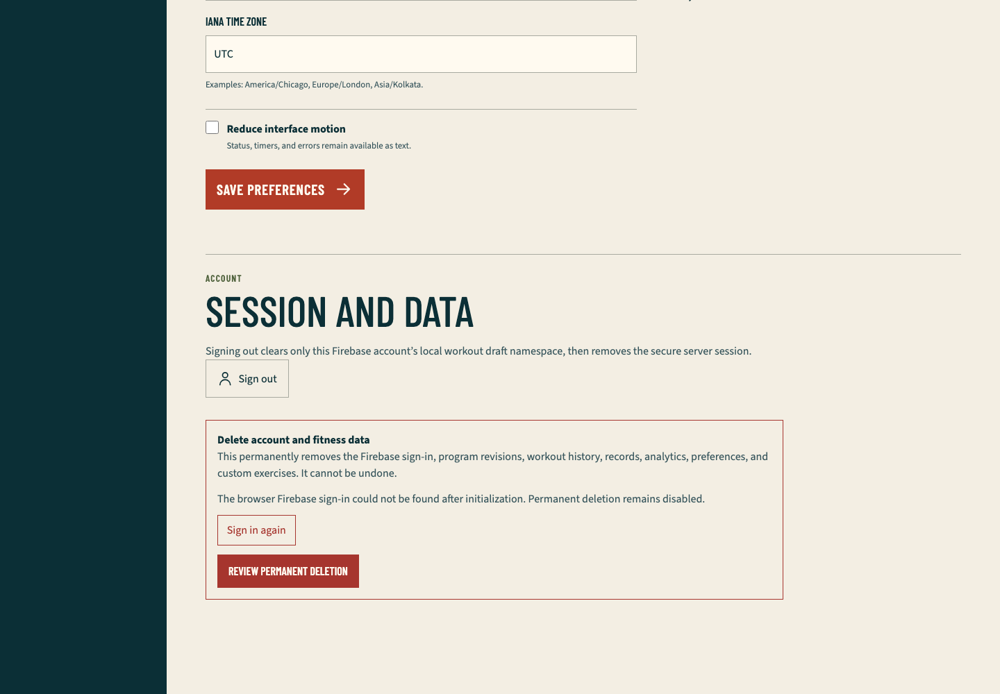
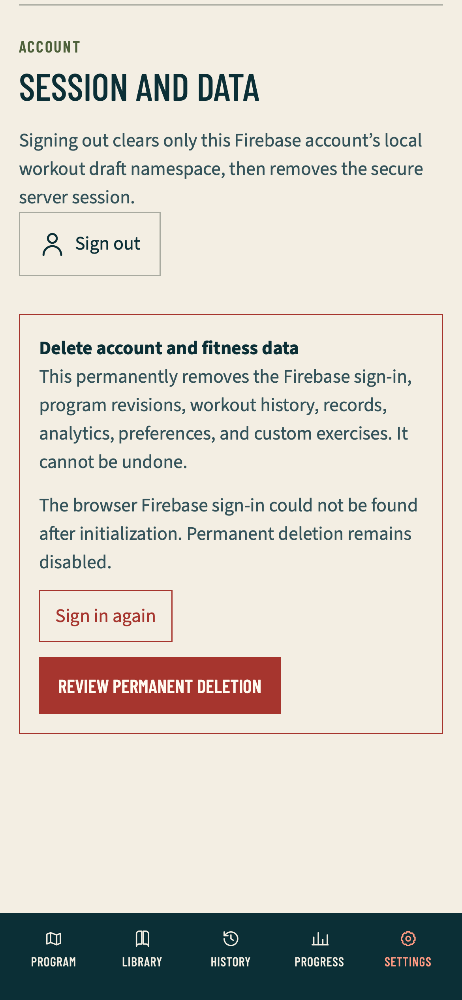

# Firebase client-auth hydration QA

## Scope

This record covers the Firebase client-auth hydration source-and-evidence checkpoint `96c85277d604c1219c72dc788c711c838d6df4c0` on branch `vishal-firebase-auth-hydration`, based on released `main` `4b50bbbd71b1378083d072156333cea94fa43907`.

The slice fixes one bounded account-deletion prerequisite: a fresh Settings page now waits for Firebase's persisted browser-auth state before reading `currentUser`. The server-derived viewer remains the ownership authority. Client identity readiness only decides whether the provider reauthentication UI may open; it never selects the deletion owner or authorizes a request.

## Verified behavior

- Firebase `authStateReady()` settles before `currentUser` is classified.
- A matching settled UID enables the review control only when the server viewer may permanently mutate.
- Loading, missing, mismatched, timed-out, rejected, observer-failed, unsupported, and later-changed identities keep deletion disabled.
- Safe client state contains no UID, email, token, cookie, SDK payload, or provider error.
- Missing and mismatched identities offer only `/sign-in?returnTo=%2Fapp%2Fsettings`; unavailable identity additionally offers a bounded readiness retry.
- The final deletion action rechecks current readiness. The existing server session, recent-authentication, CSRF, same-UID token, saga, and confirmed-only cleanup boundaries remain unchanged.
- Live-region status is present only while relevant, avoiding the duplicate hidden-dialog alert found during fail-first browser work.

## Retained fail-first evidence

- The first readiness unit test failed because no client-readiness module existed.
- The first Settings component test failed because deletion was enabled immediately and no loading state existed.
- A later status test found two simultaneous alerts: one in the closed dialog and one in the page. Rendering dialog status only while the dialog is open reduced the accessible status to the one visible source.
- The first browser attempt failed because the fixture explicitly passed `firebaseConfig: null`; the bounded hydration scenario now supplies synthetic public configuration only to that test.
- Applying that synthetic configuration to the complete fixture caused WebKit to load an external Firebase auth frame in unrelated scenarios. The exact `firebase-client-missing` scenario isolated the boundary without adding a production route, globally filtering the request, or treating the external failure as success.

## Automated verification

- Focused readiness, status, Settings, fixture-policy, and scenario tests pass: 5 files and 27 tests.
- Strict TypeScript and scoped lint pass.
- `pnpm verify` passes 93 files and 643 tests, four database files and 34 migration/bootstrap tests, all 27 exact-two approved-video mappings, generated PWA and 35-document parity, the Next.js 16.3.2 Webpack build, and the 41-route production boundary.
- `pnpm test:e2e:authenticated` passes 31 cases with one intentional engine-scoped skip across Chromium and WebKit phone, tablet, and desktop projects.
- The focused full-page hydration replay passes 2 of 2 in Chromium desktop and WebKit phone. It asserts the visible safe state, disabled destructive action, exact bounded return route, no UID disclosure, serious/critical Axe results, no horizontal overflow, and empty unexpected console, page-error, first-party HTTP, and request-failure sets.

## Preview and production evidence

Exact checkpoint `96c85277d604c1219c72dc788c711c838d6df4c0` is Ready as protected Vercel preview `dpl_7w5AQu2iwbrY7wVhD7SGtUQuAJSH`; GitHub reports the Vercel status successful. Read-only preview requests to `/` and `/sign-in` return `200` with private no-store, a fresh nonce CSP, HSTS, frame denial, strict referrer policy, and the declared permissions policy. An unauthenticated `/app/settings` response contains the exact bounded Next redirect to `/sign-in?returnTo=%2Fapp` and no application error. The one-hour preview error-log query returned no entries.

The protected preview verifies the server-rendered and unauthenticated boundaries. It does not prove a matching persisted Firebase browser identity because no disposable provider session was introduced into that hosted replay.

The identical checkpoint was fast-forwarded to `main` and released as Ready production deployment `dpl_5AHWLrSpYNF3dTrEyKJN5qbSMzcz`. GitHub reports success for exact SHA `5e64b0b885134ab20bf92a967ee656af470cf708`, and the public alias resolves to it. Read-only production replay returned `200` for `/`, `/program`, `/library`, `/sign-in`, and unauthenticated `/app/settings`; all retained private no-store, nonce CSP, HSTS, frame denial, strict referrer policy, and the declared permissions policy. Settings contained the bounded `/sign-in?returnTo=%2Fapp` redirect, and the one-hour production error scan returned no entries.

## Browser evidence

### Chromium desktop: settled missing client identity

The production Settings component shows the bounded sign-in recovery action and a natively disabled permanent-deletion review. Synthetic fixture identity and environment details are excluded from the viewport capture.

### WebKit phone: settled missing client identity

The phone viewport keeps the account/deletion card, recovery action, disabled review control, and fixed member navigation visible without overlap or horizontal overflow.

## Disk and artifact hygiene

The post-restart run used one production build or browser boundary at a time. The fixture build peaked near 181 MB and the focused Playwright result directory remained under 1 MB; both were removed after the two screenshots were copied and visually inspected. Root `.next`, fixture `.next-authenticated`, `test-results`, and `playwright-report` are absent.

The ignored 840 MB `node_modules` tree and 781 MB repository-local pnpm store remain while the goal is active because they avoid repeatedly downloading and unpacking dependencies. No simulator, detached worker, auxiliary worktree, browser trace, video, or superseded QA run remains. Available workspace volume was about 196 GiB after cleanup.

## Unproved gates

- A real matching password and Google Firebase identity restored after a hosted full-page reload.
- Hosted wrong-password, popup-cancel, successful reauthentication, and deletion completion.
- Hosted two-user authorization replay and provider revocation.
- Actual 200-percent zoom closeout, authenticated production media fallback, and Vercel Spend Management inspection.

These remain explicit later lanes; the credential-free missing-identity fixture is not presented as provider or destructive hosted proof.
