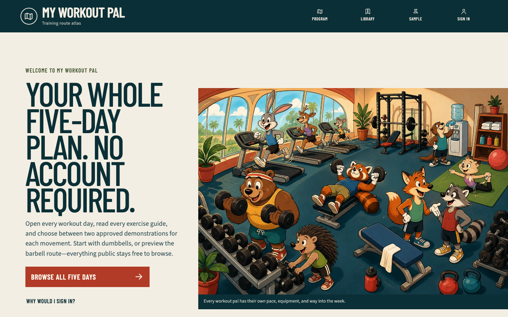
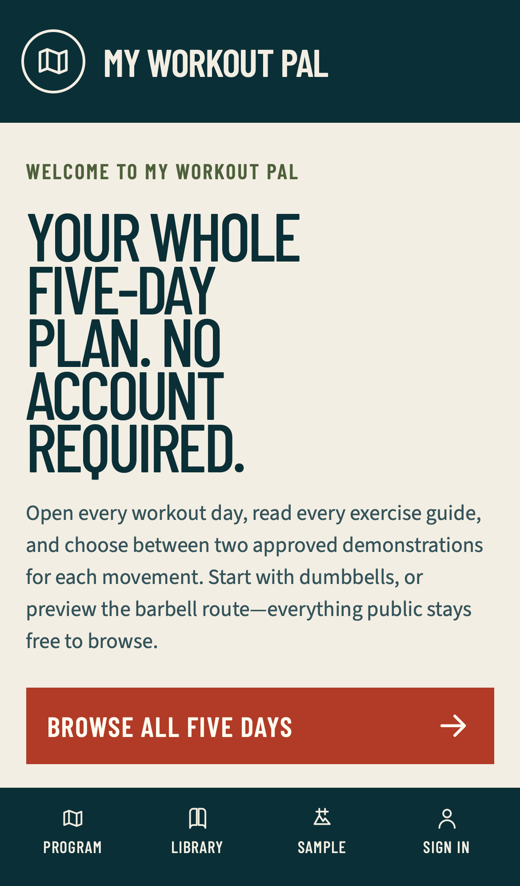

# Guest landing and contextual navigation checkpoint

## Outcome

The public root is now a genuine welcome page and `/program` remains the complete five-day explorer. Guests can inspect every starter day, canonical exercise guide, approved video pair, sample workout, and sample analytic without signing in. Account copy limits sign-in to customization, persistence, workout tracking, recovery, history, records, and personal analytics.

Exercise guides return to the exact recognized public source that opened them: the program overview, one of five days, a filtered library, or a supported sample workout. Invalid, repeated, private, authentication, absolute, control-containing, oversized, or unknown origins fall back to the public library.

## Newest visual evidence

Desktop, 1440 by 900 CSS pixels:

Phone, iPhone 13 emulation at 390 by 664 CSS pixels:

The hero is one cohesive, fully hand-drawn cartoon gym populated by expressive animal characters. It has no people, hotspots, tiles, labels, copied character, or photographic layer. The exact image-generation prompt is retained beside the runtime WebP.

## Personally observed local flow

Environment: local production build at `http://127.0.0.1:3101`, from an uncommitted guest-landing/navigation worktree based on exact pushed commit `838b518d983c6d2377cc29a2b0fd1c6cd02b8ca2`. This checkpoint deliberately precedes its release commit; the deployed preview must identify and test the resulting immutable commit separately.

1. Opened `/`, confirmed the hero loaded from the explicit precached WebP, and entered `/program`.
2. Confirmed Push, Pull, Legs, Upper, and Lower are public in both equipment profiles.
3. Opened Push, opened Dumbbell bench press, and used the visible **Push day** link to return to the exact dumbbell Push URL.
4. Searched the barbell library for `bent over row`, opened the exercise, and returned to the same equipment and search query.
5. Opened the Lower barbell sample workout, followed **Technique**, and returned through **Lower sample workout** to the same sample selection.
6. Confirmed the exercise guide retained two approved demonstrations, title/channel attribution, direct fallback, and one privacy-enhanced iframe.
7. Inspected desktop and phone layouts. The phone primary action clears the fixed navigation, the document has no horizontal overflow, and the desktop scene remains complete rather than cropped.

## Retained red-to-green evidence

- The public-return suite first failed because its domain module did not exist, then passed after the bounded parser and URL builder were implemented.
- A sample-workout origin case first failed, then passed after the fourth public context was explicitly supported.
- The PWA policy first failed because the hero was not an explicit public asset, then passed after the cache version and generated worker changed.
- Two public-shell tests first failed because shared links allowed speculative RSC prefetch. The corrected shells pass and the WebKit console remains clean.
- A landing-markup assertion first failed because rendered HTML referenced an uncached Next image-optimization URL. The hero now uses the exact source URL that the service worker precaches.
- The initial phone geometry assertion measured the CTA bottom at 615.95 CSS pixels against navigation beginning at 590.41. After the small-screen rhythm correction, the focused Chromium phone case and newest screenshot pass.
- Independent hostile-query replay exposed route interruptions for repeated library `q` and sign-in `returnTo` values. The two retained unit failures passed after both public boundaries accepted arrays at the type edge and failed closed before string normalization.
- A landing assertion retained the full-size phone preload and missing compact source. It passed after adding an explicit 768-pixel cached derivative, responsive `srcSet`/`sizes`, and removing high-priority preload signaling.

## Automated verification

- `pnpm typecheck`: pass.
- `pnpm lint`: pass.
- Permission-correct `pnpm test`: 77 files and 514 tests pass.
- `pnpm build`: Next.js 16.3.2 Webpack production build passes.
- `pnpm pwa:check`: generated service worker matches policy.
- `pnpm docs:check`: 30 Markdown/HTML pairs pass, including this report and its generated counterpart.
- Image prompt scan: 2 responsive raster variants, 0 missing sidecars.
- `PLAYWRIGHT_BASE_URL=http://127.0.0.1:3101 pnpm exec playwright test tests/e2e/public-release.spec.ts --reporter=line`: 40 of 40 pass across Chromium phone, Chromium tablet, Chromium desktop, and WebKit phone.
- Eight public surfaces per browser project have no serious or critical Axe violation; the exercise page separately verifies its titled cross-origin YouTube iframe boundary.
- Bounded Chromium phone inspection selected `/illustrations/workout-pals-gym-768.webp`, found zero hero preload links, and captured zero console messages.

## Evidence boundary

This checkpoint is a local production-build verification of the guest landing and navigation slice. It does not itself prove the configured Vercel preview or public production deployment. Preview replay, production promotion, production logs, and deployed screenshots remain required before release closeout.
