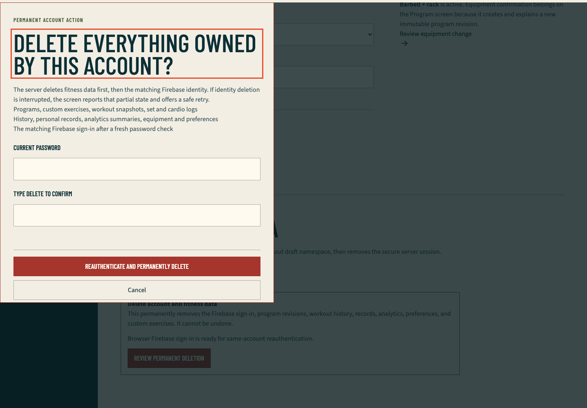
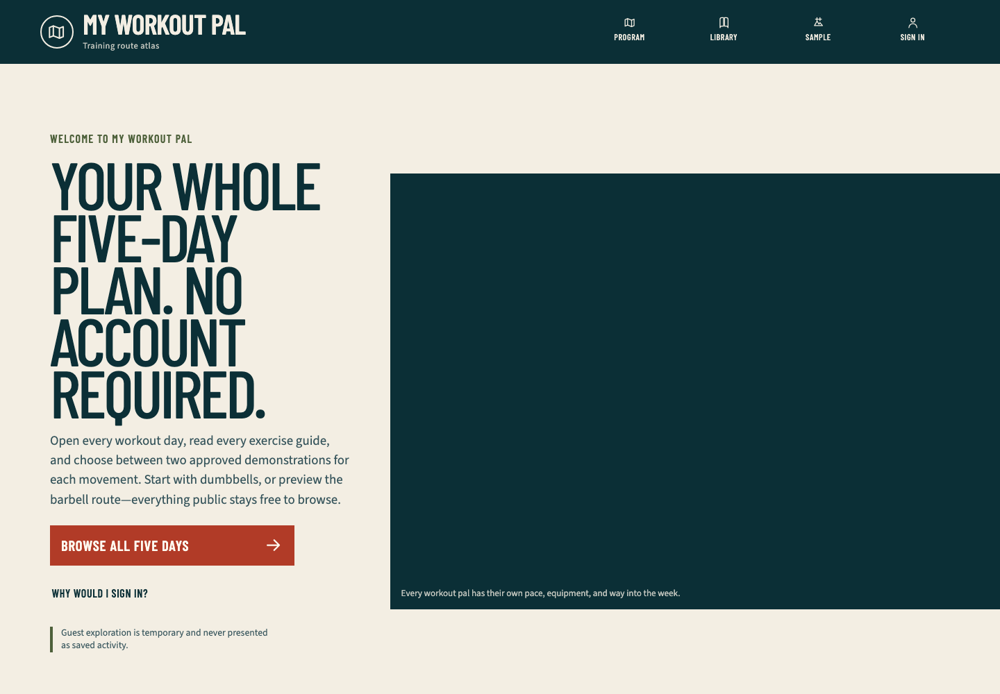

# Hosted account deletion and two-user ownership QA

## Scope

This is the newest completed QA run. The credentialed lifecycle exercised the public production application at runtime commit `aefc2ba886ee1ccff9a93784c982bc07dd63bb14`, Ready deployment `dpl_RrMuKj17bZSGVsZTun32F7YmCLTq`, using the exact committed harness checkpoint `f9f1bae477c62c6fdc0db3f51b7e4db86d6817b2`.

The run used exactly two generated high-entropy password identities in the reserved `example.com` domain. Firebase Admin created them as verified only for this test. Neither identity belonged to a member or personal mailbox. No email, password, UID, cookie, CSRF token, database URL, opaque program/exercise/workout ID, provider payload, trace, video, storage state, or browser profile was printed or retained.

## Production behavior observed

- Alice and Bob established independent production sessions through the real Firebase client and `/api/auth/session`. Both cookies were `HttpOnly`, `Secure`, `SameSite=Strict`, and path `/`.
- Alice completed the visible keyboard-driven dumbbell onboarding, then created one owner-scoped private exercise and one active workout. Bob completed the visible barbell onboarding in a separate browser context.
- Bob's foreign and random-missing custom-exercise reads were equal `404` responses with identical private `no-store` policy and safe bodies.
- Bob's foreign and random-missing workout reads were equal `404` responses with identical private `no-store` policy and safe bodies.
- Bob's attempts to activate Alice's program and a random missing program were equal `404` responses. In-memory owner row counts and full-row digests for Alice and Bob were unchanged.
- Bob's foreign and random-missing workout pages produced equal explicit not-found UI with equal private `no-store` policy and `robots=noindex`. Production returned the documented Next 16 streamed `200` boundary after headers had begun; the private APIs remained real `404` boundaries.
- Bob opened the permanent-deletion review with keyboard focus on its heading, cancelled once, and returned focus to **Review permanent deletion**. A wrong password returned the bounded application error and did not change Firebase or Neon state.
- Bob then reauthenticated with the correct password, entered `DELETE`, deleted only Bob, cleared the secure cookie and owner-local browser namespace, and returned to `/?account=deleted`. Alice's complete owner digest remained unchanged and Alice's protected program still rendered.
- Alice independently opened Settings, passed the same focused review boundary, and completed her own deletion. The final public return loaded the decoded cartoon gym hero and exposed no member identity.
- Every owned row for both captured UIDs was absent after deletion; both saga jobs were terminal or absent as permitted; global catalog, exercise-video, template, and template-revision counts were unchanged.
- Aggregate Firebase users were `0` before and `0` after. The final safe result reported 12 exact first-party mutations, four foreign/missing probe classes, `globalCountsVerified: true`, and `cleanupConfirmed: true`.

## Retained fail-first evidence

- The pure response/cleanup test initially failed because the hosted browser module did not exist. The final focused matrix passes 3 files and 11 assertions.
- Ten bounded diagnostic replays stopped safely before the exact passing run. Every one confirmed exact-account cleanup and returned Firebase to the baseline count.
- Early replays exposed a copied not-found sentence that did not match the nested production boundary. The runner now asserts the semantic not-found state rather than one presentation string.
- The production route demonstrated documented Next 16 streamed-not-found behavior: equal `200` rendered responses with `noindex`, while the private APIs returned equal `404`s. The harness now treats status equality, private cache denial, normalized visible outcome, and `noindex` as the rendered authorization proof.
- A strict hydrated-head locator did not consistently expose injected streaming metadata. The final check accepts `noindex` only when it exists in either the raw streamed document or hydrated head.
- Chromium emitted one generic console resource error for the deliberate wrong-password `400` and one for each of the six deliberate private-API `404`s. Those statuses are derived from exact awaited operations and HTTP failures; every other console error remains fatal.
- The first exact-commit replay caught a race where `page.goto()` completed before streamed not-found text reached the DOM. The final harness waits for the explicit terminal UI before comparison.
- The initial public-return capture occurred before the lazy cartoon hero decoded. The final source waits for a positive natural width, and the retained screenshot was recaptured from the same production runtime only after the image loaded.

## Automated evidence

- `pnpm exec vitest run tests/unit/hosted-deletion-browser.test.ts tests/unit/hosted-deletion-command.test.ts tests/unit/hosted-deletion-qa.test.ts`: 3 files, 11 assertions passed.
- `pnpm typecheck`: passed on exact harness source.
- Scoped ESLint for the configuration, command, browser runner, and focused tests: passed.
- `MWP_HOSTED_DELETION_EXTERNAL_ACCOUNTS_APPROVED=1 pnpm test:e2e:hosted-deletion-idor`: passed in Chromium at `1440×1000` on exact checkpoint `f9f1bae477c62c6fdc0db3f51b7e4db86d6817b2`.
- Serious and critical Axe results were empty on the rendered denial, open deletion review, wrong-password state, and Alice's intact Settings state.
- The first-party response collector matched exactly six deliberate API `404`s. No unexpected first-party failure, request failure, console warning, page error, or mutation occurred.
- The exact first-party mutation total was 12: two session creates, two onboardings, one custom exercise, one workout start, two denied activation attempts, two fresh-session exchanges for reauthentication, and two account deletions.

## Browser evidence

### Permanent-deletion review

The modal is fully visible within `1440×1000`, explains the database-first/Firebase-second boundary, names the deleted data classes, exposes password and exact-phrase inputs, and keeps the destructive and cancel controls reachable. No generated identity or opaque resource is visible.

### Public return after deletion

The final account returned to the public guest-first landing page with the complete decoded animal-cartoon gym illustration. The header offers **Sign in**, proving no authenticated shell or identity remained in the capture.

## Disk and artifact hygiene

The hosted runner launched Chromium directly and did not create `.next`, fixture `.next-authenticated`, `test-results`, `playwright-report`, trace, video, or saved-profile directories. Failed-run screenshots were deleted automatically. Four stale sub-32-KiB temporary HTML/header probes from the preceding release closeout were removed. Only the two reviewed PNGs above are retained for this run.

The reusable 840 MB `node_modules` tree and 781 MB repository-local pnpm store remain while the persistent goal has unfinished gates; keeping them avoids repeated downloads and unpacking. The workspace volume reported about 192 GiB free after the exact run.

## Remaining gates

- Real Google sign-in, Google reauthentication, and popup cancellation require an interactive Google consent session.
- Verification-link and recovery-message delivery were intentionally not observed with reserved non-deliverable addresses.
- Authenticated production video playback/fallback, actual 200-percent browser zoom, and Vercel Spend Management/notification inspection remain open.
