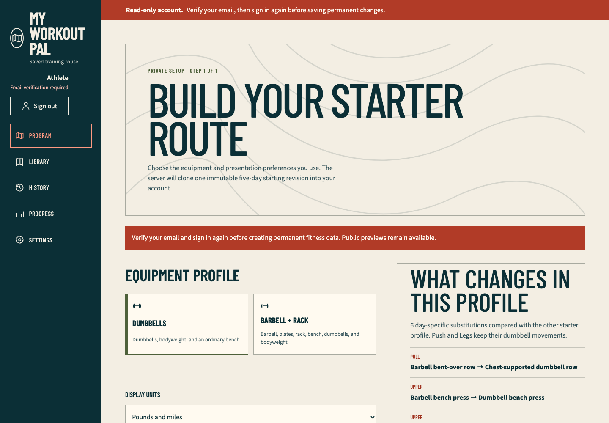
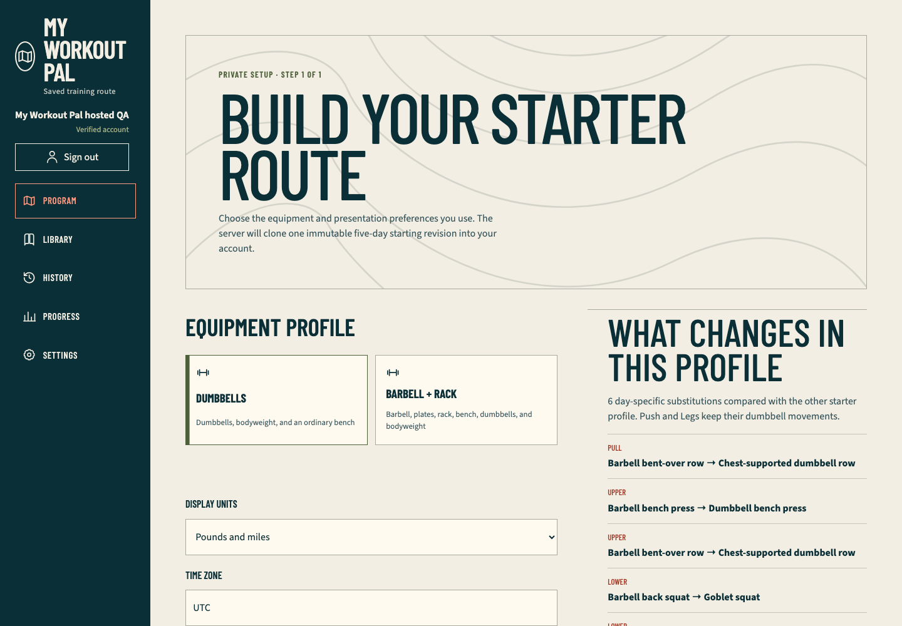

# Hosted Firebase email-action QA

## Outcome

Exact harness checkpoint `fd9c051` passed against public production runtime `f6b0ad6fa5397e51bcd0028fc11de9f619f09e21`, Ready as Vercel deployment `dpl_3iYkkQSSzvYeYyFEvHX3WbAyJHhT`. Chromium at `1440×1000` completed the production password lifecycle with two purpose-separated, non-routable `example.invalid` identities and restored Firebase users from `0` to `0`.

The application identity proved invalid credentials, browser registration, duplicate registration refusal, known/unknown recovery request acceptance, unverified read-only access, secure session creation, keyboard sign-out, and disabled permanent mutation. The action-code identity proved Admin link generation without email dispatch, strict link parsing, verification-code application, exact Firebase UID verification, reset-code inspection and confirmation, old-password rejection, recovered-password sign-in, secure cookie attributes, verified UI, and server-side revocation denial.

This is provider action-code evidence, not inbox evidence. Firebase accepted the application's verification and recovery requests, but no message was delivered or opened and no personal mailbox was used.

## TDD evidence

The first focused run failed 14 assertions because the action-link parser, independent recovered password, bounded provider actions, and stable lifecycle stages did not exist. After the initial implementation, a second retained red run failed three assertions because the identity still used a routable example domain and the runner still coupled request dispatch with action-code generation on one account. The final design uses `example.invalid` plus two distinct identities and passes:

```text
pnpm exec vitest run tests/unit/hosted-auth-qa.test.ts tests/unit/hosted-auth-command.test.ts
Test Files  2 passed (2)
Tests       27 passed (27)

pnpm typecheck
passed

pnpm exec eslint src/domain/hosted-auth-qa.ts scripts/lib/hosted-auth-browser.ts scripts/test-e2e-hosted-auth.ts tests/unit/hosted-auth-qa.test.ts tests/unit/hosted-auth-command.test.ts
passed
```

## Production browser evidence

The opt-in command loaded ignored configuration internally and printed no credential or provider payload:

```text
MWP_HOSTED_AUTH_EXTERNAL_ACCOUNT_APPROVED=1 pnpm test:e2e:hosted-auth
status                         passed
engine                         chromium
viewport                       1440x1000
firstPartyMutationCount        3
secureCookieVerified           true
emailActionCodesVerified       true
passwordRecoveryConfirmed      true
firebaseUserCountBefore        0
firebaseUserCountAfter         0
cleanupConfirmed               true
```

The exact first-party mutation set was one unverified session creation, one account-shell session deletion, and one recovered verified session creation. No onboarding, program, workout, preference, custom-exercise, analytics, or account-deletion endpoint was called. Serious/critical Axe scans, browser console warnings/errors, page errors, first-party HTTP failures, and unexpected first-party request failures were empty after accounting for the deliberately awaited Firebase credential failures.





Both images were visually inspected at native resolution. They show only the generic `My Workout Pal hosted QA` marker and account state; neither contains an address, UID, password, action link/code, API key, token, cookie, or opaque resource identifier.

## Privacy, cleanup, and disk boundary

The runner captured both exact Firebase UIDs, deleted only those UIDs in `finally`, confirmed both returned `auth/user-not-found`, and required the aggregate count to equal the pre-run baseline before reporting success. Generated addresses and credentials existed only in process memory. No action URL, provider response, trace, video, HAR, storage state, saved browser profile, or raw network capture was retained.

The production run created only the two retained screenshots, totaling about 321 KB. Root `.next`, fixture `.next-authenticated`, `test-results`, and `playwright-report` are absent. The repository retains the reusable 840 MB dependency tree and 781 MB pnpm store to avoid repeated downloads and unpacking while final provider gates remain.

## Remaining external gates

- Actual Firebase email delivery and inbox-click behavior remain unobserved.
- Google sign-in and Google reauthentication still require an authorized interactive Google browser session.
- Vercel Spend Management still requires dashboard access, the user's exact USD amount, and action-time confirmation for notifications or a team-wide production pause.
