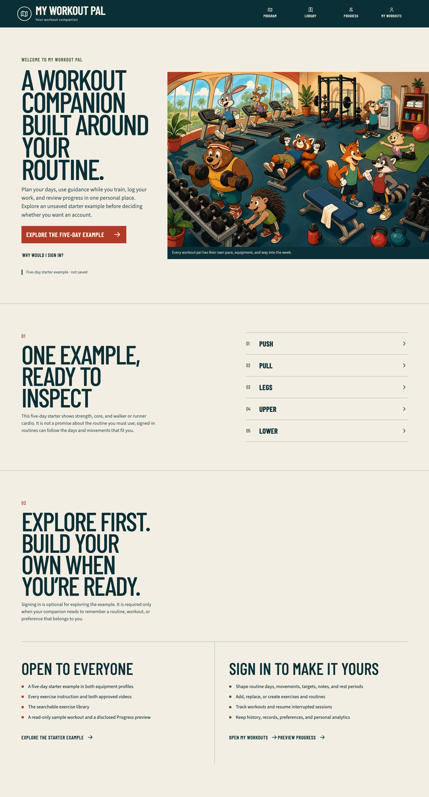
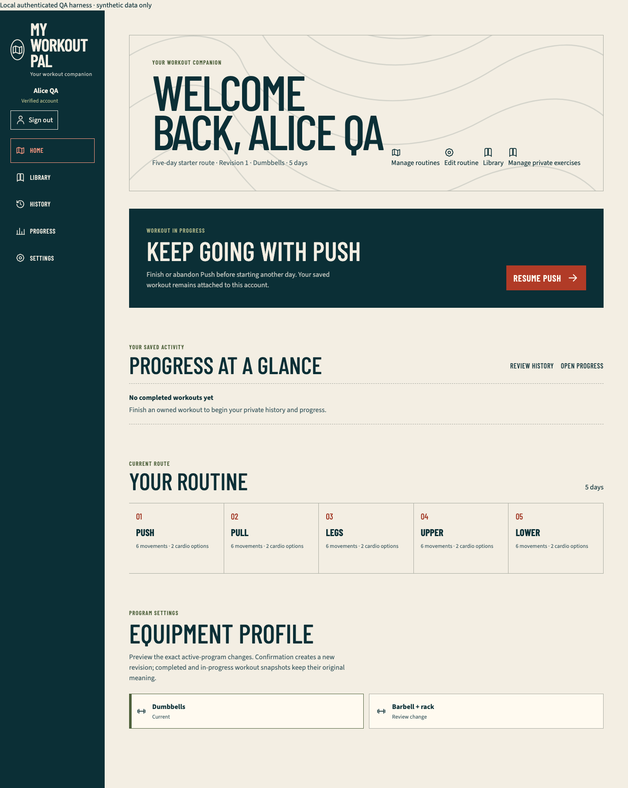
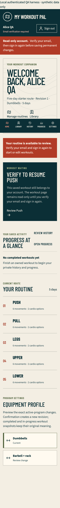

# Wave 1 personal home and companion copy QA

## Outcome

The Wave 1 personal-home and companion-copy slice is complete on `vishal/companion-home-copy`, based on verified `main` commit `4622f9e1b7783fd35cb6c23ae9396148c7c3357a`. It has not been merged, migrated, deployed, or aliased.

Guests now receive a truthful customizable-workout-companion promise, with the five-day starter presented as an unsaved example. Public navigation calls the canonical `/progress` destination **Progress**; `/sample-progress` permanently redirects there. The preview contains one visible **Sample data · not your history** disclosure and ordinary Workouts, Consistency, and Cardio labels.

Signed-in users receive a personal Home built only from their server-derived viewer and owner-scoped records. It retains visible identity, verification state, and sign-out; shows the actual active-routine topology and private completed totals; exposes routine, library, history, and progress destinations; makes a resumable workout dominant; and preserves coherent verified, unverified, empty, loading, error, new-user, returning-user, active-session, and completed-progress states.

## Scope and boundaries

- `WorkoutRepository.findResumable(viewer)` accepts only the server-derived viewer. It filters to the viewer's resumable states, orders by `updatedAt`, `createdAt`, and `id`, and returns no foreign or terminal session.
- The existing authentication, onboarding idempotency, verification gate, immutable workout snapshots, and identity/sign-out shell are preserved.
- This slice does not add a flexible day editor, movement persistence, guidance chooser, migration, seed mutation, provider change, or production Companion illustration/CSS. The established Wave 0 landing illustration remains unchanged.
- New-account onboarding truthfully saves a private copy of the five-day example. Final Wave 1 still depends on the flexible-routine worker to expose the planned example-versus-blank creation choice without duplicating that worker's persistence surface.

## Failed-before and passed-after evidence

The retained fail-first slice initially produced 6 meaningful assertion failures with 19 passes across 5 focused files: the landing still promised a fixed five-day plan, member Home lacked personal/resume/progress state, and the public cache policy still treated the old sample route as canonical. A subsequent targeted slice also failed on the missing `/progress` page, missing owner-scoped resumable read seam, and stale authenticated **Program** navigation label.

After implementation, the focused contract passed 11 files/94 tests:

- `tests/unit/landing-page.test.tsx`
- `tests/unit/public-progress-page.test.tsx`
- `tests/unit/public-navigation-prefetch.test.tsx`
- `tests/unit/pwa-cache-policy.test.ts`
- `tests/unit/public-exercise-return.test.ts`
- `tests/unit/member-program-home.test.tsx`
- `tests/unit/member-home-route-states.test.tsx`
- `tests/unit/authenticated-nav.test.tsx`
- `tests/unit/accessible-labels.test.tsx`
- `tests/integration/workout-repository.test.ts`
- `tests/integration/workout-api-contract.test.ts`

The final permission-correct complete run passed 110 files/750 tests.

## Static and generated verification

- Strict TypeScript: passed.
- Full ESLint: passed.
- Drizzle metadata check: passed.
- Exact-two approved-video seed check: 27/27 required variations passed.
- Canonical service-worker generation check: passed; `public/sw.js` precaches `/progress`, omits `/sample-progress`, and continues to exclude `/app/progress`.
- Documentation generation and parity: 47 Markdown/HTML documents passed after this report replaced the prior latest report.
- Next.js 16.3.2 Webpack production build: passed, including canonical `/progress` and compatibility `/sample-progress` routes.
- Production boundary: 42 App Router entries passed with no authenticated fixture route in the application build.

## Browser verification

The public production-mode matrix passed 47 tests across Chromium phone, Chromium tablet, Chromium desktop, and WebKit phone, with the one maintained WebKit service-worker capability skip. It covers the companion landing promise, five-day-example disclosure, canonical Progress page and redirect, account entry, serious/critical Axe checks, touch targets, reduced motion, dark mode, overflow, and Chromium offline recovery.

The authenticated production-mode fixture passed 34 tests with 2 intentional engine-scoped skips. Chromium desktop and WebKit phone exercised new, verified, unverified, returning, resumable, completed, retry, immutable-history, and owner-isolation states. Geometry checks also passed on Chromium phone/tablet and WebKit tablet/desktop. The unverified resumable Home was additionally rendered and asserted at a 320-by-700 CSS-pixel WebKit viewport: no horizontal overflow, material controls at least 44 by 44 CSS pixels, and content padding at least the fixed bottom-navigation height.

The first full public replay encountered one generic WebKit `Load failed` console event while automation immediately replaced a redirected sign-in page. The exact isolated flow passed. Waiting for the rendered sign-in boundary and network idle preserved the zero-console-error assertion and made the repeated full matrix pass.

All browser records use public data or the local authenticated fixture's explicit synthetic-data banner. No real user identity or fitness record appears in the retained screenshots.

## Local tooling distinction

The shared dependency tree could not be managed through pnpm in this worktree: pnpm stopped before execution with `ERR_PNPM_ABORTED_REMOVE_MODULES_DIR_NO_TTY`, and Vite's default config loader could not write `node_modules/.vite-temp` (`EPERM`). No dependency reinstall, purge, permission change, or shared-tree mutation was performed. Verification used the repository's existing dependencies through direct Node entry points and Vitest's runner config loader. The complete suite was then run on the permission-correct path because the existing YouTube test probe requires a loopback listener.

## Integration verdict

This branch is ready for parent Wave 1 review and integration. The parent must reconcile new-account example-versus-blank creation with the flexible-routine branch, retain the owner-scoped Home composition and canonical `/progress` contract, regenerate docs and the service worker after conflict resolution, and rerun the combined unit, build, public, and authenticated gates. No migration or deployment is required for this slice.
